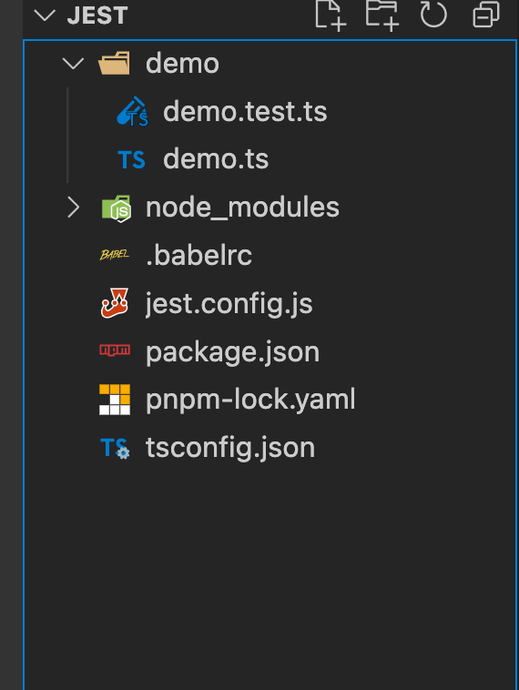

# Jest 开始学习
参考地址：https://jestjs.io/zh-Hans/docs/getting-started

## 文件结构


## package.json 文件安装的依赖
```json
{
  "name": "jest",
  "version": "1.0.0",
  "description": "",
  "main": "index.js",
  "scripts": {
    "test": "jest"
  },
  "author": "",
  "license": "ISC",
  "devDependencies": {
    "@babel/core": "^7.17.9",
    "@babel/preset-env": "^7.16.11",
    "@types/jest": "^27.4.1",
    "jest": "^27.5.1",
    "ts-jest": "^27.1.4",
    "typescript": "^4.6.3"
  }
}
```
注意：ts 环境安装请参考：<https://www.npmjs.com/package/ts-jest>

## 初始化配置文件
```
npx ts-jest config:init // ts 初始化 jest.config.js 文件的方式
jest --init // js 环境初始化配置文件
```

## 使用 Babel
如果需要使用 Babel，可以通过 yarn来安装所需的依赖。

```
yarn add --dev babel-jest @babel/core @babel/preset-env
```

创建 babel.config.js 文件
```js
module.exports = {
  presets: [['@babel/preset-env', {targets: {node: 'current'}}]],
};
```

