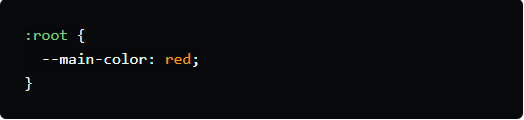
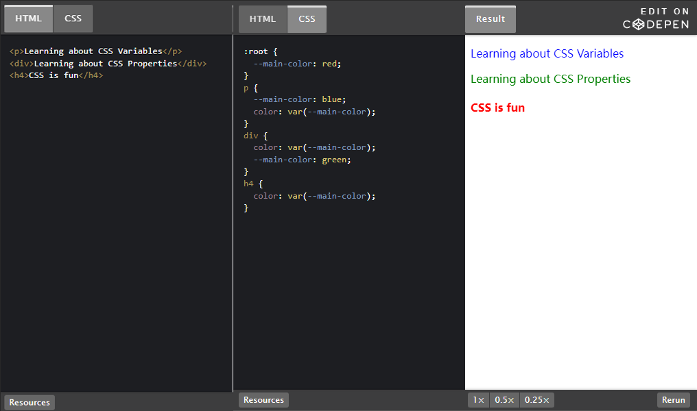
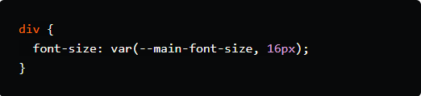
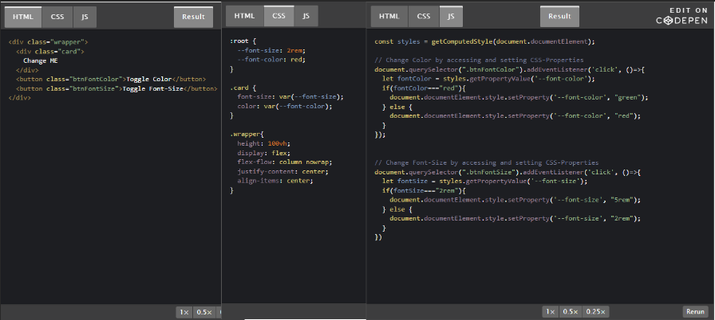

# css变量

## 作用域

在CSS中，我们不使用任何这样的关键字let,const, var;我们只是在用户定义的变量名前使用两个连字符(破折号--),并将它们放在作用域中。

scope就像JavaScript中的作用域一样功能范围,块作用域,全球范围我们在CSS中也有作用域。

在这里，我们已经用:root选择者它的目标是DOM的顶部元素，因此具有全局作用域。同样,我们也可以基于不同的CSS选择器拥有其他的局部作用域。

在这里，我们已经用:root选择者它的目标是DOM的顶部元素，因此具有全局作用域。同样,我们也可以基于不同的CSS选择器拥有其他的局部作用域。

>* 如何访问CSS-变量。
>* 局部变量比全局变量具有更高的优先级。
>* 我们可以使用这个属性，以后再声明，CSS还是会考虑的，就像div.

## 访问CSS变量var()

如上所示，我们可以使用var()功能。

var()函数接受属性名作为参数，如果它存在，则从样式表中检索它的值，并将其替换为实际的CSS- Property 。

因此，不同于其他语言的变量在CSS中，不存储值，他们只是替换它与实际的CSS值时使用。

* var()也可用于在属性丢失时提供回退值。

## 在JavaScript中使用CSS变量

考虑下面的Codepen ，了解如何在JavaScript中访问和更改CSS- Variable 。

### getPropertyValue
·若要在运行时获取自定义属性的值，请使用getPropertyValue()计算的CSS样式声明对象的方法。
### setProperty
·若要在运行时设置自定义属性的值，请使用setProperty()CSS样式声明对象的。
